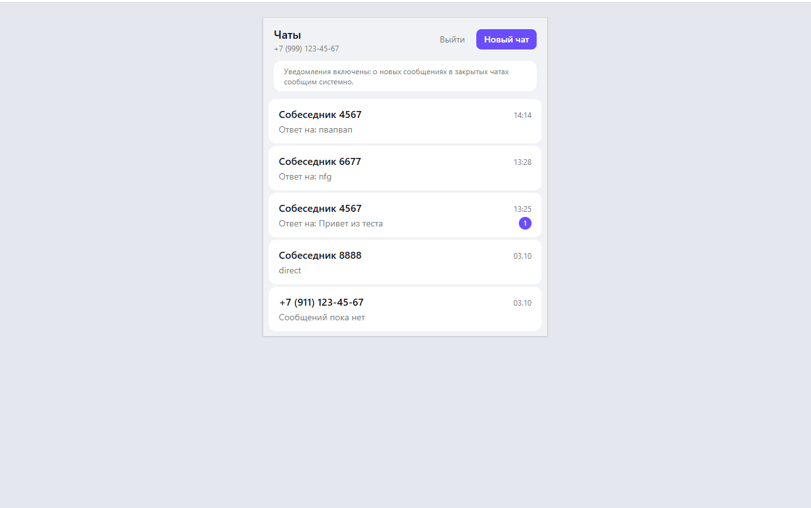
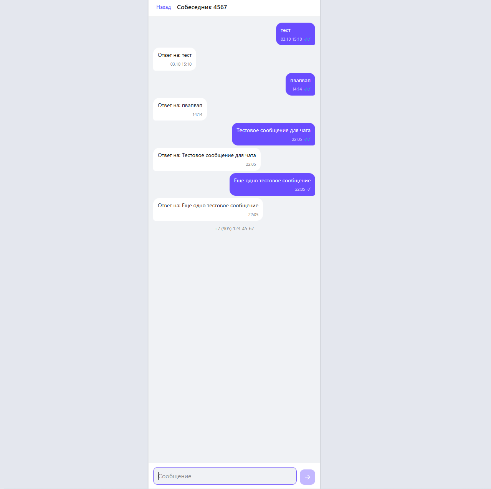
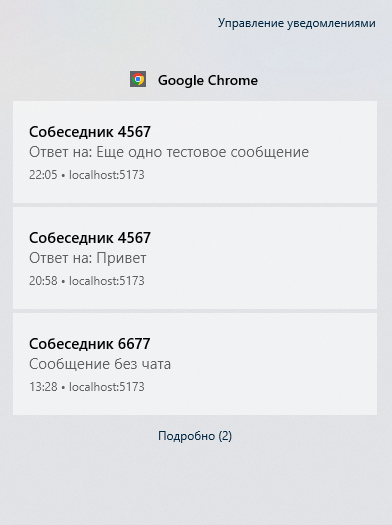
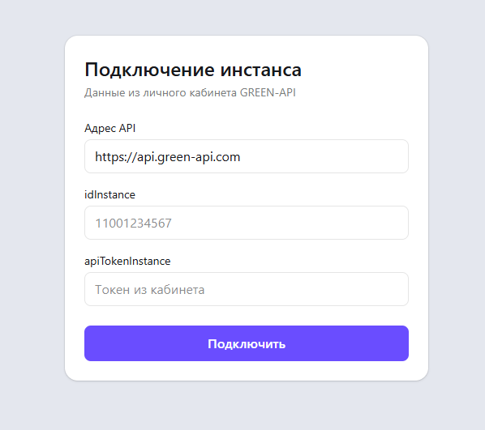
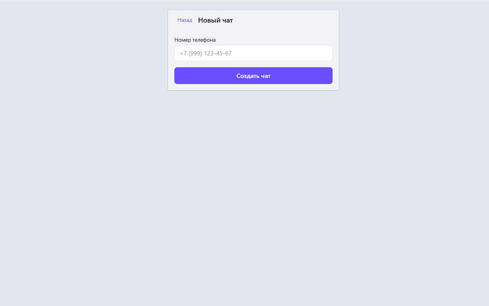
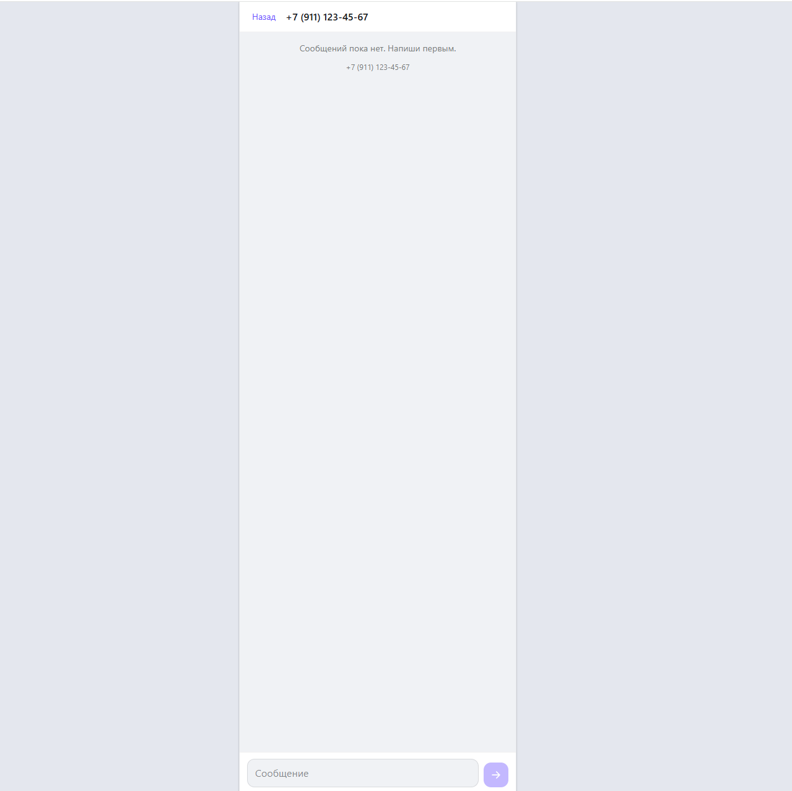
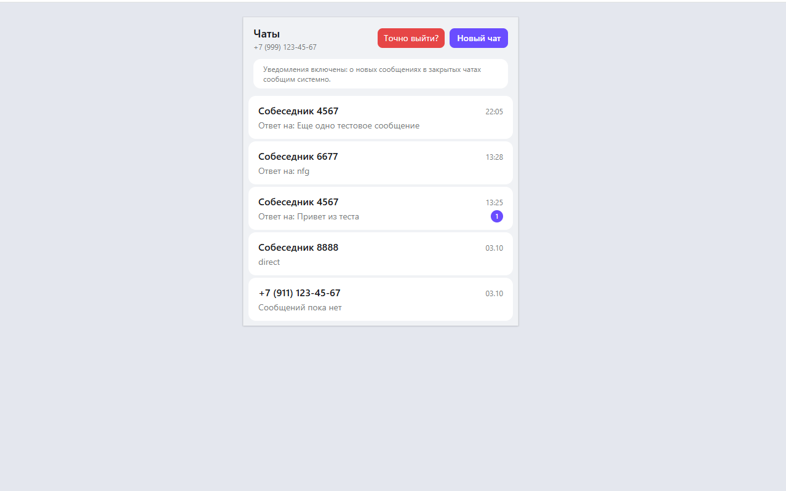

# Тестовое задание: чат для MAX на GREEN-API

Пользовательский интерфейс для отправки и получения текстовых сообщений в
мессенджере MAX через сервис GREEN-API.

Приложение целиком статическое: собирается в набор файлов, работает в браузере
и не требует своего бэкенда или базы данных.

Демо: https://swimmerheart.github.io/green-api-max-chat/





## Стек

React 19, TypeScript, Vite, Tailwind CSS 4.

## Локальный запуск

```bash
npm install
npm run dev
```

Приложение откроется на http://localhost:5173.

Нужен адрес API, `idInstance` и токен инстанса. Без реального аккаунта их даёт
мок, который поднимается во втором терминале:

```bash
npm run mock
```

Данные для мока:

| Поле         | Значение                |
| ------------ | ----------------------- |
| Адрес API    | `http://localhost:8787` |
| `idInstance` | `1100000001`            |
| Токен        | `testToken`             |

Мок сам отвечает на входящие, поэтому сценарий целиком проигрывается локально:
после отправки сообщения он присылает ответ, а затем статусы `delivered` и
`read`.

Служебные маршруты мока, работают без токена:

```bash
# входящее сообщение в чат 81234567
curl -X POST http://localhost:8787/mock/incoming \
  -H 'Content-Type: application/json' \
  -d '{"chatId":"81234567","text":"Привет из мока"}'

# удаление сообщения
curl -X POST http://localhost:8787/mock/deleted \
  -H 'Content-Type: application/json' \
  -d '{"chatId":"81234567","stanzaId":"INCOMING000001"}'

# смена состояния инстанса
curl -X POST http://localhost:8787/mock/state \
  -H 'Content-Type: application/json' \
  -d '{"stateInstance":"notAuthorized"}'
```

Особые номера в моке: заканчивается на 9 — аккаунта в MAX нет, `CheckAccount`
вернет `exist: false`; заканчивается на 0 — аккаунт вне MAX, при отправке
придет статус `noAccount`.

Остальные команды:

```bash
npm run typecheck      # проверка типов
npm run lint           # eslint
npm run format         # prettier
npm run build          # сборка в dist
npm run preview        # предпросмотр сборки
```

## Настройка инстанса в GREEN-API

Инстанс создается и авторизуется в личном кабинете: создать инстанс для МАХ и
отсканировать QR-код в мессенджере. Приложение только запрашивает
`idInstance` и токен, само ничего не создает.

Для приема уведомлений у инстанса должны стоять такие настройки:

- `webhookUrl` - пустое значение, получаем через HTTP API, а не вебхуком;
- `incomingWebhook`, `outgoingWebhook`, `stateWebhook` - `yes`.

Это можно выставить в кабинете или методом `SetSettings`. Если эти настройки
выключены, входящие не придут вообще: приложение не сможет отличить "тишину"
от "поломки".

## Как пользоваться

1. Открыть страницу и заполнить адрес API, `idInstance` и токен.
2. Нажать «Подключить». Если инстанс не авторизован, приложение скажет об
   этом и предложит отсканировать QR-код в кабинете.
3. Создать чат по номеру телефона получателя. Номер проверяется методом
   `CheckAccount`, он же возвращает `chatId` для отправки.
4. Написать сообщения. Входящие приходят в ленту автоматически.

## Скриншоты

Подключение к инстансу: адрес API, `idInstance` и токен.



Создание чата по номеру телефона получателя.



Чат с открытым композером: поле ввода, счетчик символов, кнопка отправки.



Выход из аккаунта с подтверждением.



## Требования задания

| Требование                                     | Где реализовано                                                                            |
| ---------------------------------------------- | ------------------------------------------------------------------------------------------ |
| Интерфейс отправки и получения сообщений в MAX | `src/App.tsx`, `src/components/`                                                           |
| Работа через GREEN-API                         | `src/api/greenApiClient.ts`                                                                |
| Только текстовые сообщения                     | `src/components/Composer.tsx`, вложений и медиа нет                                        |
| Прототип чата с web.max.ru                     | `src/index.css` - цвета и отступы, `src/components/MessageList.tsx` — лента и пузыри       |
| Минимальный набор функций                      | подключение, список чатов, создание чата, отправка, прием, статусы, удаление               |
| Отправка методом SendMessage                   | `GreenApiClient.sendMessage` => `POST /waInstance{id}/sendMessage/{token}`                 |
| Получение методом HTTP API                     | `GreenApiClient.receiveNotification` и `deleteNotification`, `src/hooks/useChatPolling.ts` |
| React                                          | `src/main.tsx`                                                                             |

Сверх прототипа добавлены два удобства, которые не обязательны: уведомления
браузера о входящих и выход из аккаунта.

## Как устроено

**Получение сообщений.** Приложение висит на `ReceiveNotification` с
`receiveTimeout` 25 секунд и держит запрос открытым. Пришедшее уведомление
подтверждается через `DeleteNotification` по `receiptId` - без этого оно
повторится. Подтверждение идемпотентно: если запрос уже отработал, повторный
вызов по тому же `receiptId` не приводит к ошибке.

**Идемпотентность на своей стороне.** Входящие события могут прийти повторно
после переподключения, поэтому каждое отслеживается по `idMessage` и
`stanzaId`, и дубли в ленте не появляются.

**Оптимистичная отправка.** Исходящее появляется в ленте сразу со статусом
«отправлено», а статус из вебхука обновляет его по `idMessage`. Если запрос
упал, сообщение остается в ленте с ошибкой и его можно отправить повторно.

**Хранение.** Список чатов, история и учетные данные лежат в `localStorage`.
При выходе учетные данные стираются, история остается, чтобы не потерять
переписку. Объем истории ограничен 300 сообщениями на чат.

**Переподключение.** При обрыве связи polling повторяет попытки с
нарастающей паузой и показывает статус в шапке чата.

## Ограничения

**Не проверялось на живом инстансе МАХ.** Приложение разрабатывалось и
тестировалось на локальном моке GREEN-API, повторяющем формат ответов
документации. На настоящем инстансе не запускалось, поэтому возможны
расхождения. Это основное, что стоит проверить в первую очередь.

**Риск CORS.** Браузер отправляет запросы с вашего домена на адрес GREEN-API.
Если API не отдает `Access-Control-Allow-Origin` для этого домена, браузер
заблокирует запрос и приложение покажет «Нет связи с GREEN-API». Обойти это
из приложения нельзя, но можно указать адрес своего GREEN-API в поле «Адрес
API».

**Уведомления требуют HTTPS.** Notification API недоступен на http и
localhost. Без HTTPS приложение работает, но не показывает уведомления.

**Одна вкладка.** Вторая вкладка того же браузера, включая инкогнито,
перехватывает входящие и перезаписывает историю в общем `localStorage`.
Открывать нужно одну вкладку.

**Удаление сообщений** работает, если мессенджер присылает уведомление
`deletedMessage`. На живом инстансе это не проверено.
